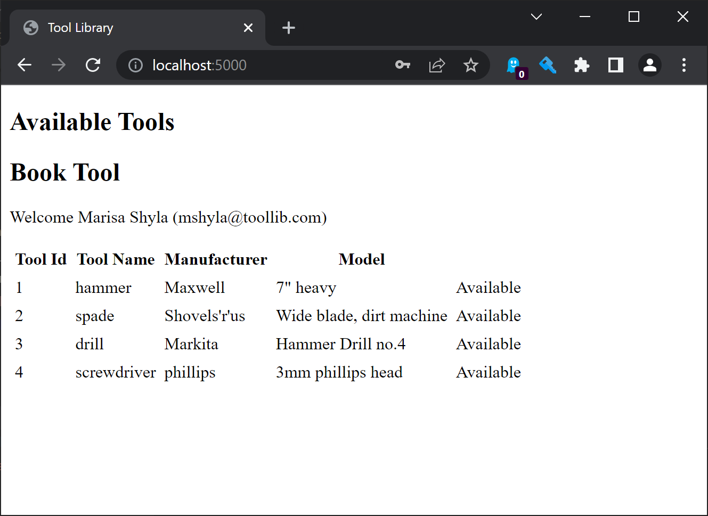
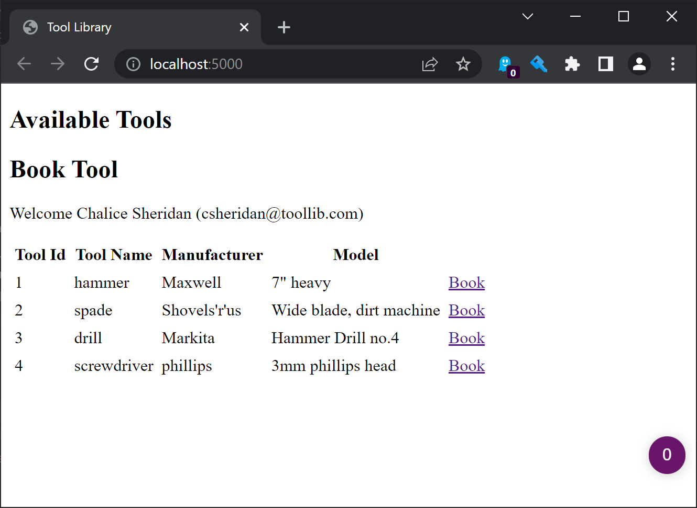
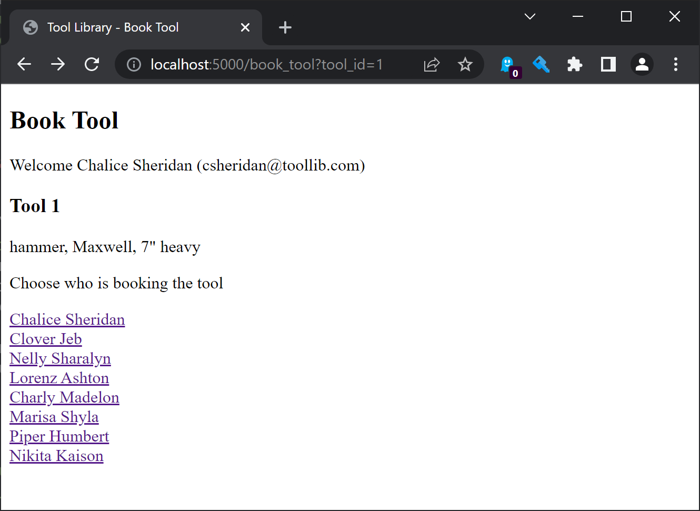
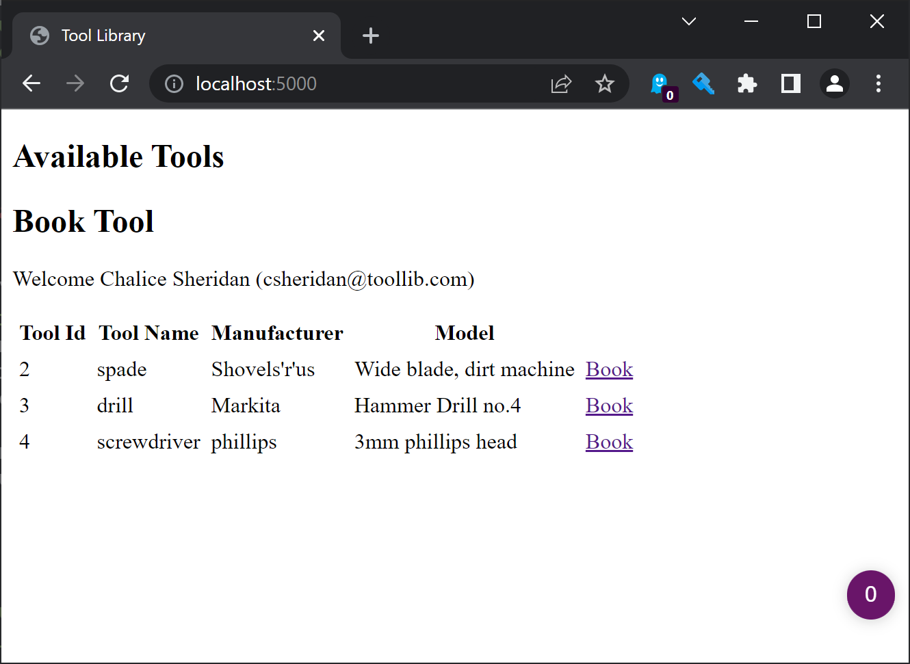

# Part 5: Booking tool UI

In the previous post some security was put into the tool library, and now it is time to book a tool from the web browser. To do this two new http handlers need to be created, and because there is some parts of the web site that are common across all pages, then these common parts will be extracted into a components files.

Here is a break down of the changes by file.

- api_tool_library.pl
- api_user.pl (modify)
- load.pl (modify)
- tools.db
- users.txt
- web_book_tool.pl (new)
- web_components.pl (new)
- web_index.pl (modify)
- web_server.pl

Firstly it might be worth looking at the web components, and then refactor the `web_index.pl` handler to use one of the components.

The first component is the page header, and in this post there will be two components created in total. The file headers for the `web_components.pl` file looks like the following.

    :- module(web_components, [
        page_heading/4,
        tool_description/3
    ]).

    :- use_module(library(http/html_write)).
    :- use_module(api_user).

Now add in a header component, this is a DCG that we can call directly from the `http_reply` predicate.

    page_heading(Title, User) -->
        {
            user_name(User, UserName),
            user_email(User, Email),
            format(atom(WelcomeMsg), 'Welcome ~w (~w)', [UserName, Email])
        },
        html(
            div(class=heading, [
                h2(Title),
                p(class='welcome-msg', WelcomeMsg)
            ])
        ).

The parts of the DCG between the curly brackets is normal Prolog code that will get the username to print the welcome message. Then the `html/3` DCG call will format the terms for the heading into a html format that can be printed.

Now add this into the `web_index.pl` handler.

    % return the html page
    reply_html_page(
        title('Tool Library'),
        div([
            h2('Available Tools'),
            \page_heading('Book Tool', User),
            div(Table)
        ])).

Note that we can call the page heading using the `\page_heading...` which allows us to call a DCG inside another DCG term effectively.

There is another component that is required, this will be used on the booking page, and the return tool page. Again this is very simple, and just prints some details of a tool so that the person knows which tool was selected.

    tool_description(tool(ToolId, Type, Make, Model)) -->
        html(
            div(class=tool, [
                h3(['Tool ', ToolId]),
                p([Type, ', ', Make, ', ', Model])
            ])
        ).

Next job is to create the handlers for booking a tool, and then linking these back into the tool table. The comments explain what is included here.

    :- http_handler(root(book_tool), book_tool, [id(book_tool)]).
    book_tool(Request) :-

        % get the logged in user and verify that they can book tools
        request_user(Request, User),
        verify_user_role(User, book),

        % Get a the tool id from the http query (eg: /?tool_id=1)
        http_parameters(Request, [tool_id(ToolId, [integer, optional(false)])]),

        % Find the tool that is being booked, which needs to be available
        api_tool_library:tool(ToolId, Tool),

        % Print a list of users to choose from, choosing the users will book the tool
        user_choice_list(ToolId, UserList),

        % reply, using the page_heading and tool_description components, plus add the user list
        reply_html_page(
            title('Tool Library - Book Tool'), [
            \page_heading('Book Tool', User),
            \tool_description(Tool),
            div([p('Choose who is booking the tool'), UserList])
        ]).

When booking a tool, a list of users needs to be shown so that the librarian can choose which person is going to be booking the tool.

    user_choice_list(ToolId, div(class=userlist, UserList)) :-

        % read all the users from the password file into a list
        http_read_passwd_file('users.txt', Data),

        % map the password file user to a user term
        maplist(pwd_file_user, Data, Users),

        % create a html row for each user
        maplist(user_list_row(ToolId), Users, UserList).

    % a single user formatted in a div
    user_list_row(ToolId, User, UserListRow) :-

        % get the user details
        user_username(User, UserName),
        user_name(User, Name),

        % create a link to a different handler, which will do the actual booking
        % pass the tool_id and user as request parameters (eg:/?tool_id=1&user=fred)
        http_link_to_id(user_books_tool, [tool_id(ToolId), user(UserName)], HREF),

        % create the user row, which the link.
        UserListRow = div(a([class=btn, href=HREF], Name)).

the `pwd_file_user/2` predicate in the above code is a new helper in the `api_user.pl` file to map users from the password file.

    % convert the entry in a password file to a user data structure
    pwd_file_user(passwd(UserName, _, Fields), User) :-
        userfile_user([UserName|Fields], User).

When a user is selected from the `book_tool` http handler, this links to a different handler called the `user_books_tool` handler, which does the actual booking.

    :- http_handler(root(user_books_tool), user_books_tool, [id(user_books_tool)]).
    user_books_tool(Request) :-

        % get the logged in user and verify that they can book tools
        request_user(Request, User),
        verify_user_role(User, book),

        % the http parameters contain a tool id and the user who is borrowing the tool
        http_parameters(Request, [
            tool_id(ToolId, [optional(false), integer]),
            user(Who, [optional(false), atom])
        ]),

        % use the tool library api to do the booking
        api_borrow_tool(ToolId, Who),

        % redirect back to the tool table
        http_redirect(see_other, location_by_id(home), Request).

Ok, the last thing to do is to show a link on the tool table for tool librarians so that they can book tools. To do this, a few modifications need to be made to the `web_index.pl` file. I've only included a summary of the changes here, the full code is in the source download.

        ...

        % pass the user when generating the tool table
        tools_table(Tools, User, Table),

        ...

    tools_table_([], 'No Tools To Show').
    tools_table_([T|Tt], Table) :-
        Table = table(cellpadding=3, [
            thead([
                th('Tool Id'),
                th('Tool Name'),
                th('Manufacturer'),
                th('Model'),

                % a new column is required for the tool 'action'
                th('')
            ]),
            tbody([T|Tt])
        ]).

    tool_row(User, available_tool(tool(Id, Type, Make, Model)), Row) :-

        % get the action based on the permissions of the person
        available_action_column(User, Id, ActionCol),

        Row = tr([
            td(Id),
            td(Type),
            td(Make),
            td(Model),

            % draw the action
            td(ActionCol)
        ]).

    % the action is either a link to the book_tool handler, or a static string showing 'Available'
    % this is based on the users role.
    available_action_column(User, ToolId, span(class=btn, Btn)) :-
        user_role(User, book)
        -> (
            http_link_to_id(book_tool, [tool_id(ToolId)], HREF),
            Btn = a(href=HREF, 'Book')
        )
        ;
        Btn = 'Available'.

That is all the changes, the screen is a bit more complicated now, this is what the tools table looks like for someone that cannot book tools:

This is what it looks like for someone that can book tools

If a tool is selected, then the user list is shown

And once the user is selected, then the tool disappears from the available list!

So now, the tool library can lend out tools to people, but there is no way to return the tools yet, that is the next task!
