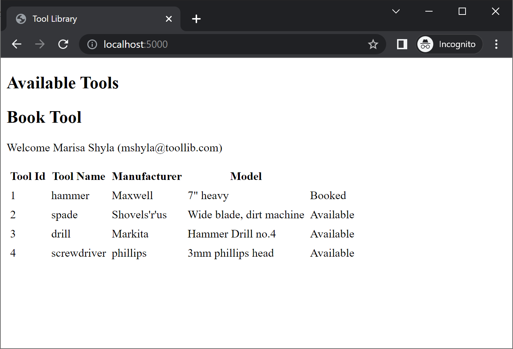
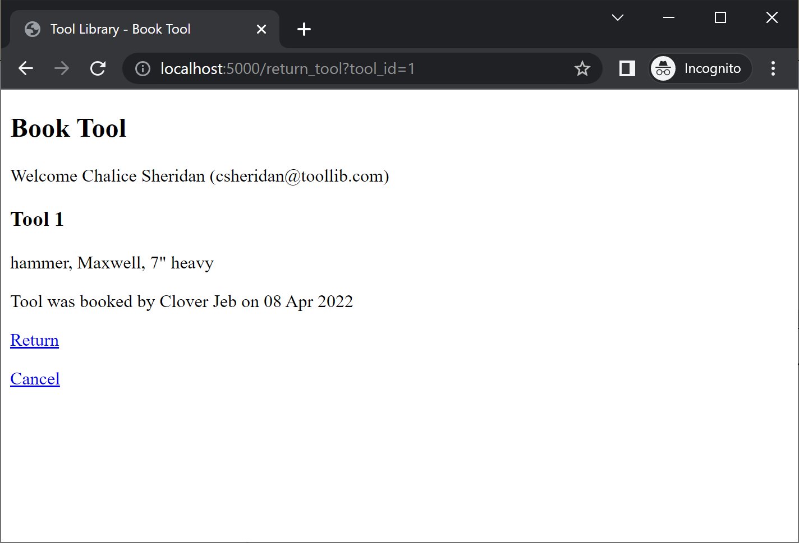
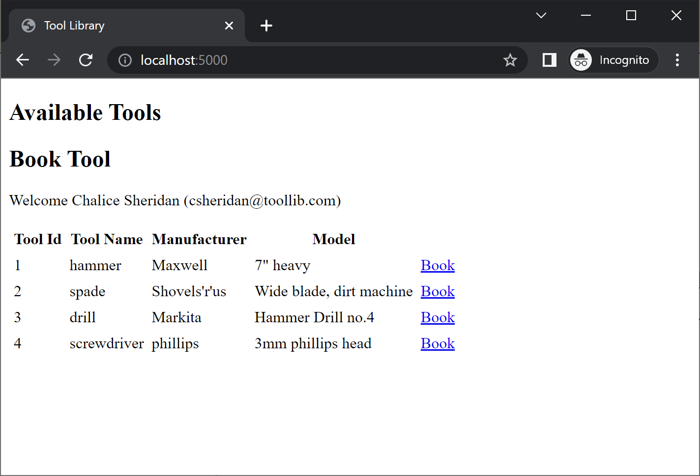

# Part 6: Returning tools UI

In the last post, the ability to add a tool via the web was implemented, and that leaves one more function to implement, which is to return a tool that is already booked.

Here is a summary of the files that will change:

- api_tool_library.pl
- api_user.pl (modify)
- load.pl (modify)
- tools.db
- users.txt
- web_book_tool.pl (modify)
- web_return_tool.pl (new)
- web_components.pl
- web_index.pl (modify)
- web_server.pl

The main changes are in the `web_index.pl` file and the `web_return_tool.pl` file, but some minor refactoring will be done to keep the source a bit cleaner. It is always a good idea to clean up code as you progress through a project as common functions become apparent.

Firstly, the `web_index.pl` does not currently show tools that have been booked, and so we can't create a link to return the tool. To show the booked tools, a change to the query to get tools is required.

```prolog
    ...

    % Adding a disjunction in the findall query, will return both
    % available (not booked) and borrowed (booked) tools.
    findall(Tool, (
        api_available_tool(Tool)
        ; api_borrowed_tool(Tool)
    ), Tools),

    % The query will order the tools by available first, then borrowed so sorting is required.
    sort(1, <, Tools, SortedTools),

    ...
```

The `sort/4` predicate allows sorting by an argument of a term. This is required here because the terms that come back from `api_available_tool/1` and `api_borrowed_tool/3` are different, so they would normally be grouped by the sort. If instead the sort uses the first term, then both values are `tool/4` terms, so the sort will use the next value which is the ID. That is what will be used to sort here.

Now that all the values are coming back in the query, they still won't be displayed, because at the moment, only `available_tool/1` terms are handled in the generation of table rows, in fact the program will fail at this point.

There are several changes required here, these are outlined in the comments

```prolog
    % Refactor the existing tool_row/3 rule so that it generates the action column
    % then creates the table row. This allows one predicate to generate the table row.
    tool_row(User, available_tool(Tool), Row) :-
        Tool = tool(ToolId, _, _, _),
        available_action_column(User, ToolId, ActionCol),
        tool_table_row(Tool, ActionCol, Row).

    % Add a new tool_row/3 rule to cater for borrowed_tool/3 terms.
    % there is a new booked_action_column/3 predicate as well to create
    % the return link.
    tool_row(User, borrowed_tool(Tool, _, _), Row) :-
        Tool = tool(ToolId, _, _, _),
        booked_action_column(User, ToolId, ActionCol),
        tool_table_row(Tool, ActionCol, Row).

    % A new general predicate to generate tool rows, with a context based action column.
    tool_table_row(tool(Id, Type, Make, Model), ActionCol, Row) :-
        Row = tr([
            td(Id),
            td(Type),
            td(Make),
            td(Model),
            td(ActionCol)
        ]).

    % no changes to the available tool actions
    available_action_column(User, ToolId, span(class=btn, Btn)) :-
        user_role(User, book)
        -> (
            http_link_to_id(book_tool, [tool_id(ToolId)], HREF),
            Btn = a(href=HREF, 'Book')
        )
        ;
        Btn = 'Available'.

    % The new booked action requires a 'return' role, and will print 'Booked'
    % for those that don't have permissions to return tools.
    booked_action_column(User, ToolId, span(class=btn, Btn)) :-
        user_role(User, return)
        -> (
            http_link_to_id(return_tool, [tool_id(ToolId)], HREF),
            Btn = a(href=HREF, 'Return')
        )
        ;
        Btn = 'Booked'.
```

Phew, that is a lot of changes, but they aren't complicated. The page can be shown now with a link (the link doesn't work yet!).

For users that don't have permission they see booked tools.



For users that can return tools, a link appears


Next the handler for returning tools is required, the layout of this is similar to the book tool handler, and there is an `http_handler` to show the tool that needs to be returned, and another `http_handler` to actually return the tool, and redirect back to the home page.

First, module definition and module includes.

```prolog
    :- module(web_return_tool, []).

    :- use_module(library(http/http_parameters)).
    :- use_module(library(http/http_dispatch)).
    :- use_module(library(http/html_write)).
    :- use_module(api_tool_library).
    :- use_module(api_user).
    :- use_module(web_components).
```

Then define the first handler, which is the `return_tool` handler.

```prolog
    :- http_handler(root(return_tool), return_tool, [id(return_tool)]).
    return_tool(Request) :-

        % Check that the user has a 'return' role.
        request_user(Request, User),
        verify_user_role(User, return),

        % Get the tool id from the request parameters
        http_parameters(Request, [tool_id(ToolId, [integer, optional(false)])]),

        % Some information about the tool that is borrowed is required
        % the existing api_borrowed_tool predicate can be adapted to get this info.
        Tool = tool(ToolId, _, _, _),
        api_borrowed_tool(borrowed_tool(Tool, Who, When)),

        % Create a link to the handler that actually returns the tool
        http_link_to_id(tool_is_returned, [tool_id(ToolId)], ToolIsReturnedLink),

        % Create a fancy formatted string to show who borrowed the tool, and when.
        % The date is stored as a timestamp so it needs to be converted to a human readable form.
        user_details(Who, BorrowUser),
        user_name(BorrowUser, Name),
        format_time(atom(WhenFormatted), '%d %b %Y', When),
        format(atom(BookingDesc), 'Tool was booked by ~w on ~w', [Name, WhenFormatted]),

        % create the page, note that the page heading, and tool description are being reused.
        reply_html_page(
            title('Tool Library - Book Tool'), [
                \page_heading('Book Tool', User),
                \tool_description(Tool),
                p(BookingDesc),
                div([
                    a(href=ToolIsReturnedLink, 'Return'),
                    p(a(href=location_by_id(home), 'Cancel'))
                ])
            ]
        ).
```

The page gives an option to cancel the booking, which returns to the home page to show the list again.

There is a subtle change required to get the user details for the user that borrowed the tool, because the name of the user is actually stored in the password file. A new predicate is created to get the user_details for the return handler.

```prolog
    % Get the user details for a user name
    % the users predicate from the api_user module
    user_details(UserName, User) :-
        users(Users),
        user_username(User, UserName),
        member(User, Users).
```

And in the `api_user.pl` file, a new api is added.

```prolog
    :- use_module(library(http/http_authenticate)).

    users(Users) :-
        % load the users from the password file, this could be cached but ok for demo
        http_read_passwd_file('users.txt', Data),
        maplist(pwd_file_user, Data, Users).
```

Which leads to a minor refactor in the `web_book_tool.pl` file when generating the list of users:

```prolog
    % Instead of reading the password file, use the common method in the api_user module
    user_choice_list(ToolId, div(class=userlist, UserList)) :-
        users(Users),
        maplist(user_list_row(ToolId), Users, UserList).
```

Now that that is out of the way, it is time to implement the link to actually return a tool. This handler is similar to the book tool version, but simpler because there is only one parameter (the tool_id).

```prolog
    :- http_handler(root(tool_is_returned), tool_is_returned, [id(tool_is_returned)]).
    tool_is_returned(Request) :-
        request_user(Request, User),
        verify_user_role(User, return),

        http_parameters(Request, [tool_id(ToolId, [optional(false), integer])]),

        api_return_tool(ToolId),
        http_redirect(see_other, location_by_id(home), Request).
```

That is all the required changes, now when clicking a 'return' link, the page is shown.



Clicking on the Return link will change the state back to available.



That is all the functionality is was in the list of requirements done!

Right now the site is very basic and there is no styling, so the final task is to make it look presentable before releasing to wild.
